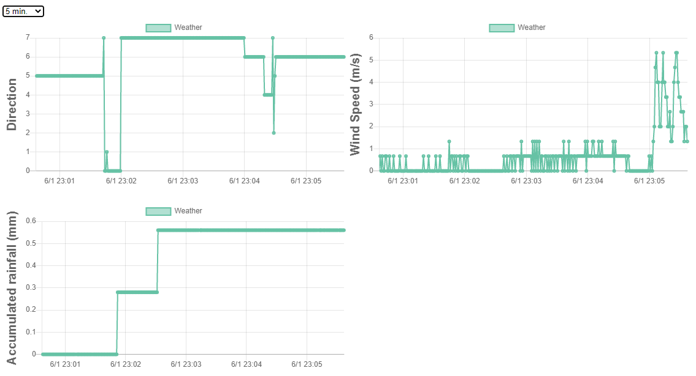

# WiFi Weather Meter 

## Hardware Components
- [Weather Meter Kit](https://www.sparkfun.com/products/15901) (SparkFun) x 1
- [ATOM Lite ESP32 Development Kit](https://m5stack.com/products/atom-lite-esp32-development-kit) (M5Stack) x 1
- [ATOMIC Proto Kit](https://m5stack.com/collections/all/products/atomic-proto-kit) (M5Stack) x 1
- Resister 1/6W 10k x 1
- PETG filament for 3D printer

## Pin Assignment
|M5Atom|Weather Meter|
|---|---|
|GND|GND|
|3V3|for pull up|
|G19|RAIN_COUNT|
|G33|WIND_VANE (pull up 10k)|
|G23|ANEMOMETER|

## Software
- [Eclipse Mosquitto](https://mosquitto.org/) (MQTT broker)
- [DesignSpark Mechanical](https://www.rs-online.com/designspark/mechanical-software) (3D Modeling)

## Setup
- Install Mosquitto to your PC/Raspberry Pi and enable MQTT over Websocket.
- Modify WiFi SSID/Password/MQTT broker address on [M5Atom/M5AtomWeather.ino](M5Atom/M5AtomWeather.ino) and burn it to the M5Atom.
- Modify MQTT broker address on [Viewer/index.html](Viewer/index.html).
- No server required to view weather data
- Just open the index.html on your web browser.

## How to make
see https://twitter.com/ksasao/status/1261583413368123392
